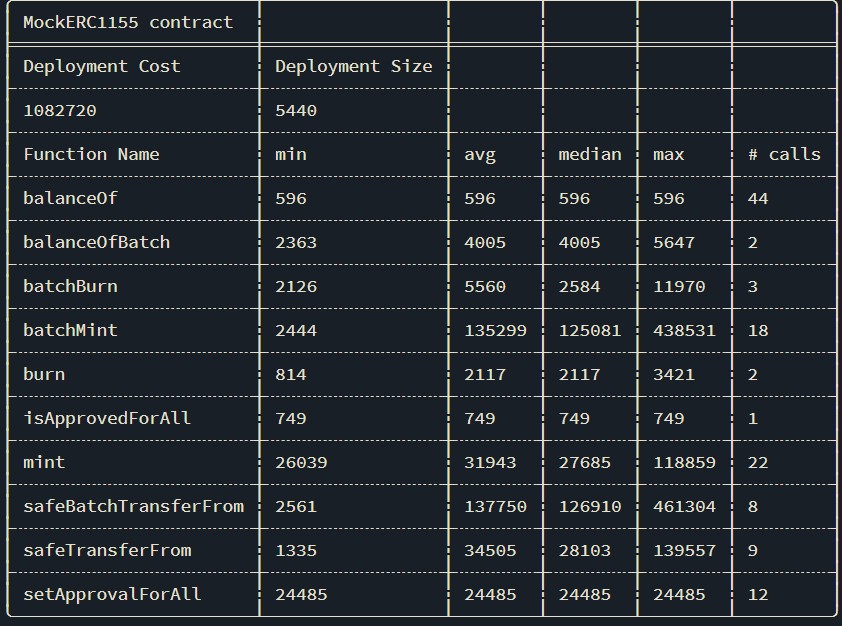

# Foundry

## Table of contents
- [Foundry](#foundry)
  - [Table of contents](#table-of-contents)
  - [Installation](#installation)
  - [Deploy](#deploy)
  - [Intrect with deployed Contract](#intrect-with-deployed-contract)
      - [Using Terminal:](#using-terminal)
      - [Once you do that you will find value in hex so](#once-you-do-that-you-will-find-value-in-hex-so)
  - [Install External Libraries](#install-external-libraries)
  - [Tests Commands](#tests-commands)
    - [Understanding the traces](#understanding-the-traces)
    - [Gas Reporter and Snapshots](#gas-reporter-and-snapshots)
    - [Debugger](#debugger)
    - [Cast](#cast)

## Installation
- to set forge: open bash and type: source /c/Users/LENOVO/.bashrc
- then: forge init
- to compile: forge compile

## Deploy
- There are 2 ways to deploy smart contract
  - 1) Using `create`
    - `forge create --rpc-url <your_rpc_url> --private-key <your_private_key> src/MyContract.sol:MyContract`
    - verify and deploy: `forge create --rpc-url <your_rpc_url> \
    --constructor-args "ForgeUSD" "FUSD" 18 1000000000000000000000 \
    --private-key <your_private_key> \
    --etherscan-api-key <your_etherscan_api_key> \
    --verify \
    src/MyToken.sol:MyToken`
  - 2) Using `script`
    - `forge script script/DeploySimpleStorage.s.sol --rpc-url http://127.0.0.1:8545 --broadcast --private-key 0xac0974bec39a17e36ba4a6b4d238ff944bacb478cbed5efcae784d7bf4f2ff80`
    - to make it more flexible just make a .env file and add PRIVATE_KEY and deploy it like
    -  -> once you create .env file you need to follow these steps first
    -     -> open terminal type following commands
                `chmod +x load_env.sh`
                `source load_env.sh`
    - `forge script script/DeploySimpleStorage.s.sol --rpc-url $URL --broadcast --private-key $PRIVATE_KEY`
    - just like we are using local URL to deploy our smart contract you can use different networks(sepholia, eth, polygon) URL to deploy smart contract.
    - Another way to deploy smart contract is thirdweb: `npx thirdweb deploy`: it will automatically open a website and you can deploy your smart contract on any network you want

## Intrect with deployed Contract

#### Using Terminal:

1) To send a write transaction

    - `cast send <smart contract address> "store(uint256)" <input here> --rpc-url <rpc url here> --private-key <private key here> `

        - #### example:  `cast send 0xe7f1725e7734ce288f8367e1bb143e90bb3f0512 "store(uint256)" 786 --rpc-url http://127.0.0.1:8545 --private-key 0xac0974bec39a17e36ba4a6b4d238ff944bacb478cbed5efcae784d7bf4f2ff80`

2) To send a read transactiom

    - `cast call <smart contract address> "retrieve()"`

        - #### example: `cast call 0xe7f1725e7734ce288f8367e1bb143e90bb3f0512 "retrieve()"`

#### Once you do that you will find value in hex so
    - `cast --to-base 0x0000000000000000000000000000000000000000000000000000000000000312 dec`
    - it will convert the value into decimal

## Install External Libraries

- to install any external library
    - `forge install smartcontractkit/chainlink-brownie-contracts@versionOfRepo --no-commit`
it will be saved in lib

- check foundry.toml: I added this `remappings = ["@chainlink/contracts/=lib/chainlink-brownie-contracts/contracts/"]` it means whenever in smart contract whenever you will import `@chainlink/contracts/anyFile` it will be fetched from `chainlink-brownie-contracts/contracts/`..

## Tests Commands

- once you add console.log you should run tests like this
    - `forge test -v`
- you can also run tests on test networks just type
    - `forge test --fork-url $SEPHOLIA_RPC_URL`
- There are 2 methods of creating a intance of a contract
  - 1) In [SimpleStorage.t.sol](test/SimpleStorage.t.sol), you can see we have created a separate deploy [script](src/SimpleStorage.sol) for deploying the contract and it is returning the object of the contract so we can use it in our tests. 
  - 2) You can create tests inside the test file, just like [TestingDocumenation.t.sol](test/TestingDocumenation.t.sol) and create a instance of the contract inside the test file. it just used the keyword `new` to create a instance of the contract.

### Understanding the traces
- `forge test -vvv` or `forge test -vvvv` will give you the traces of the transaction
  -  [<Gas Usage>] <Contract>::<Function>(<Parameters>)
    ├─ [<Gas Usage>] <Contract>::<Function>(<Parameters>)
    │   └─ ← <Return Value>
    └─ ← <Return Value>
- Traces will come with different colors
  - Green: For calls that do not revert
  - Red: For reverting calls
  - Blue: For calls to cheat codes
  - Cyan: For emitted logs
  - Yellow: For contract deployments

### Gas Reporter and Snapshots
- #### Gas Reporter
  - `forge test -vvv --gas-reporter`
  - it will give you the gas usage of each function
  - 
- #### Gas Snapshot
  - `forge test -vvv --gas-snapshot`
  - it will give you the gas usage of each function and also the gas usage of the whole test file

### Debugger
- #### Debugger
  - `forge debug <test file path>`
  - it will open a website and you can debug your smart contract
  - check website for more [website documentation](https://book.getfoundry.sh/forge/debugger)

### Cast
- Cast is a command line tool that allows you to interact with your smart contracts from the command line, and it allows you to send transactions and call functions on your smart contracts.
- e.g: `cast call 0x6b175474e89094c44da98b954eedeac495271d0f "totalSupply()(uint256)" --rpc-url https://eth-mainnet.alchemyapi.io/v2/Lc7oIGYeL_QvInzI0Wiu_pOZZDEKBrdf
8603853182003814300330472690`